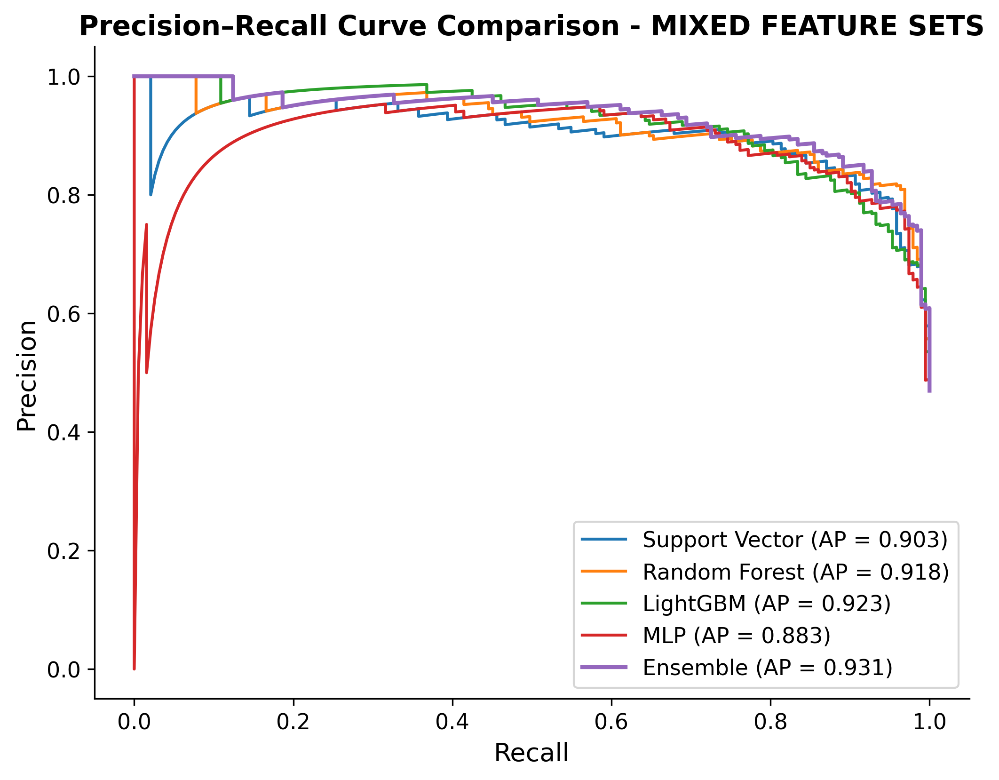
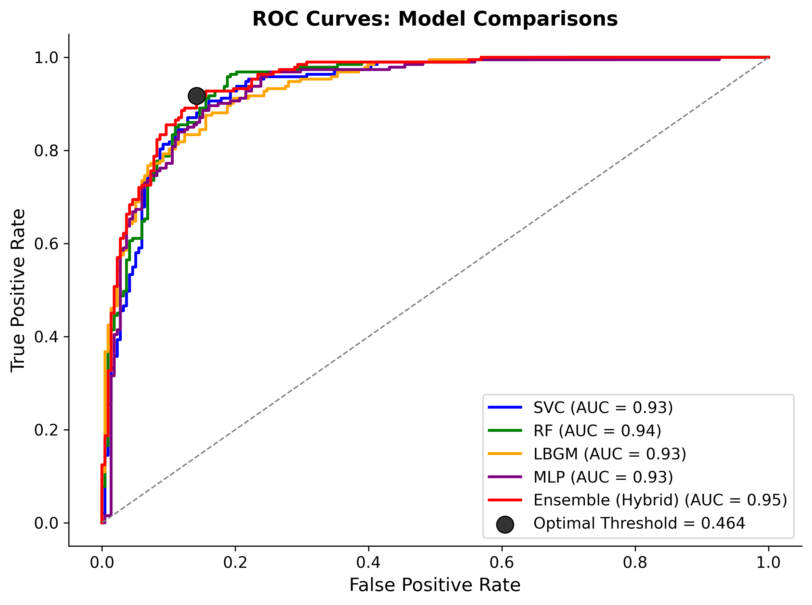
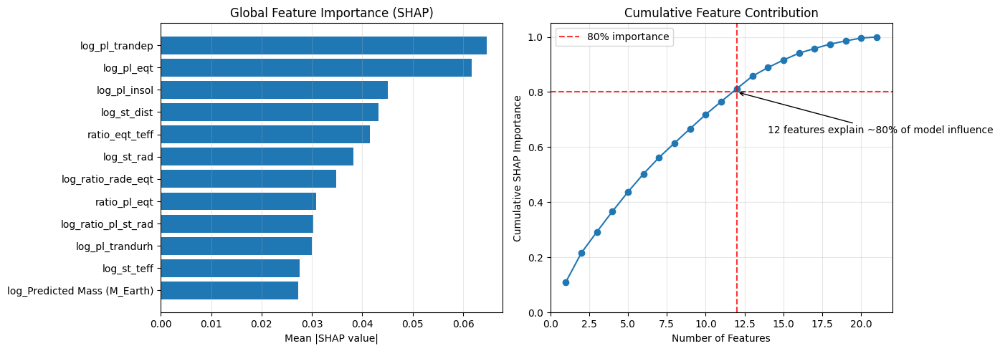

# Exoplanet Candidate Classification Using Ensemble Machine Learning on Large-Scale Public Data
## Executive Summary

*A rigorous comparative study of probabilistic classification models and ensemble methods applied to large, noisy observational data.*

This project develops a reproducible ensemble learning framework to improve the automated screening of exoplanet candidates using data derived from Transiting Exoplanet Survey Satellite (TESS) observations available via NASA's Exoplanet Archive.

The objective was to evaluate and compare heterogeneous classification models and assess whether a soft-voting ensemble model improves probabilistic discrimination performance in a large, noisy observational dataset.

Multiple models, which included Random Forest, Support Vector Machine, LightGBM and Multi-Layer Perceptron, were combined into an ensemble model to enhance predictive performance and robustness.

The ensemble model achieved strong results across key metrics with superior discrimination performance (Average Precision = 0.923), while maintaining controlled false-positive rates.

Model interpretability was addressed using SHAP analysis, revealing a small subset of astrophysical features driving the majority of predictions.

This work demonstrates how ensemble methods can provide a transparent, computationally accessible approach to support efficient allocation of follow-up observational resources in large-scale astronomical surveys.

## Problem Statement

The TESS candidate catalogue contains large volumes of observational data used to identify potential exoplanets. Candidate classifications are derived from noisy photometric measurements and may include false positives due to astrophysical or instrumental effects.

The challenge is to develop a robust probabilistic classification framework capable of distinguishing confirmed planetary signals from non-planetary detections while maintaining reliable precision-recall trade-offs.

This project evaluates multiple machine learning approaches and investigates whether a soft-voting ensemble can improve classification stability and predictive performance across heterogeneous model families.

## Dataset

## Project Overview

Pipeline includes:
- Data preprocessing and cleaning
- Feature engineering and transformation
- Train/Test separation to prevent data leakage
- Model comparison across multiple algorithm families
- Precision-recall based evaluation
- Soft-voting ensemble implementation
- Threshold analysis and performance evaluation

## Methodology
ML pipeline + Feature Engineering

## Model Evaluation

The following classifiers were implemented and tuned:
- Support Vector Classifier (SVC)
- Random Forest (RF)
- Gradient Boosting (LightGBM)
- Multi-Layer Perceptron (MLP)
- Soft-Voting Ensemble (equal weighting)

The Ensemble combines predicted probabilities from heterogeneous base learners to stabilise classification performance.

## Evaluation

### Precision-Recall Curve

  

*Figure 1: Precision–Recall curve showing ensemble outperforming all base models (AP = 0.931).*

### ROC Curve

  

*Figure 2: ROC curve comparison across models.*

### Confusion Matrix

*Figure 3: Confusion matrix for ensemble at optimal threshold.*

## Threshold Optimisation

## Model Interpretability
To understand which features most strongly influenced classification decisions, SHAP (Shapely Additive Explanation) values were computed for the ensemble model.

The analysis identifies the most influential features contributing to candidate classification, providing transparency to the ensemble's decision making process.

  
  

*Figure 4: (Left) Feature importance ranked by mean absolute SHAP values, highlighting the primary astrophysical drivers of model predictions. (Right) Cumulative SHAP importance indicates approximately 80% of the model's predictive influence is explained by the top 12 features.*

## Key Insights

The final soft-voting ensemble achieved the highest Average Precision (0.931) among the evaluated configurations, outperforming individual classifiers, particularly LightGBM (AP=0.923) trained on both full and reduced feature sets.

## Evaluation Strategy

Model performance was evaluated using a held-out test set that preserved the original class distribution to ensure unbias. Given the nature of the classification task, evaluation focused on Precision–Recall (PR) curves and Average Precision (AP) rather than accuracy, as PR analysis provides a more informative assessment under class imbalance.

In addition to Precision-Recall analysis, models were evaluated using:
- Receiver Operating Characteristic (ROC) curves and ROC-AUC
- Confusion matrices at selected operating thresholds

ROC-AUC was uses to assess overall ranking performance across thresholds and to compare discriminative capacity independent of class-specific error costs.

Confusion matrices were examined at representative probability thresholds to analyse the trade-off between false positives and false negatives, providing operational insight into screening performance under different decision criteria.

While ROC-AUC offers a global view of separability, analysis of precision degradation at higher recall levels is more informative than true negative rates.

Threshold selection was explored to balance recall sensitivity against precision stability depending on screening objectives.

## Future Work

