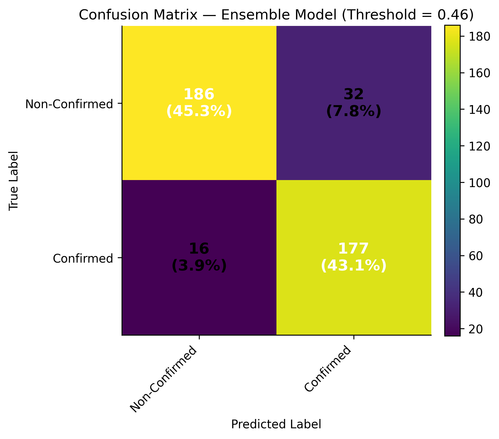

# Exoplanet Candidate Classification Using Ensemble Machine Learning on Large-Scale Public Data

*A rigorous comparative study of probabilistic classification models and ensemble methods applied to large, noisy observational data.*


## Executive Summary

This project develops a reproducible ensemble learning framework to improve the automated screening of exoplanet candidates using data derived from Transiting Exoplanet Survey Satellite (TESS) observations available via NASA's Exoplanet Archive.

The objective was to evaluate and compare heterogeneous classification models and assess whether a soft-voting ensemble model improves probabilistic discrimination performance in a large, noisy observational dataset.

Multiple models, which included Random Forest, Support Vector Machine, LightGBM and Multi-Layer Perceptron, were combined into an ensemble model to enhance predictive performance and robustness.

The ensemble model achieved strong results across key metrics with superior discrimination performance (Average Precision = 0.923), while maintaining controlled false-positive rates.

Model interpretability was addressed using SHAP analysis, revealing a small subset of astrophysical features driving the majority of predictions.

This work demonstrates how ensemble methods can improve the priortisation of exoplanet candidates, supporting more effective allocation of follow-up observational resources in large-scale astronomical surveys.

## Problem Statement

The TESS candidate catalogue contains large scale photometric data used to identify potential exoplanets, but candidate classifications are often uncertain due to noisy signals and false positives due to astrophysical and instrumental effects.

This project addresses the challenge of developing a robust probabilistic classification framework to distinguish true planetary signals from non-planetary detections. A key objective is to achieve an effective balance between precision and recall, ensuring that meaningful candidates are identified while minimising false positives.

To achieve this, multiple machine learning models are evaluated and combined using a soft-voting ensemble approach to improve predictive performance, classification stability and precision-recall trade-offs compared to individual model types. The resulting framework is also designed to be computationally efficient and accessible, enabling use by researchers and citizen scientists with limited computational resources.

Although developed in the astrophysical context, the modelling and evaluation framework is transferable to other domains, including fraud detection, risk modelling, anomaly detection and medical diagnosis.

## Dataset

The dataset was obtained from the TESS Project Candidates Catalogue via  NASA Archive (snapshot as at March 2025) and comprised photometric and derived features used to identified exoplanet candidates. A binary target was constructed by encoding candidate disposition as '1' (confirmed) and '0' (false positive) forming the basis for supervised classification.
The initial dataset contained 7525 samples with 65 features prior to pre-processing. 


## Project Overview

This project develops an end-to-end machine learning pipeline, which encompasses data pre-processing and cleaning, feature transformation and train-test separation and class balancing for robust model evaluation.

Multiple machine learning models are compared using precision-recall metrics, followed by the implementation of a soft-voting ensemble to improve predictive stability and overall classification performance. Threshold analysis is further applied to assess trade-offs in candidate selection and support effective priortisation.


## Methodology

This project adopts a quantitiative framework guided by the Knowledge Discovery in Database (KDD) methodology, enabling systematic extraction of patterns from large real-world datasets.

### Data Source

The Transiting Exoplanet Survey Satellite (TESS) Project Candidate Catalogue consists of derived planetary and stellar parameters generated from light curve observations, where noise reduction and detrending have already been applied by the upstream pipeline.

### Data Processing & Feature Engineering 

Data pre-processing was conducted to ensure consistency and model readiness. Instances with ambiguous or non-confirmed dispositions (e.g 'FA'.'APC', 'PC' and missing labels) were removed, in addition to features that were missing value or those unsuitable for median imputation. Auxillary limit features did not provide meaningful predictive value and were excluded from the sample. The remaining numerical features were imputed using median values and transformed using logarithmic scaling to reduce skewness and stabilise variance. Data was then scaled using StandardScaler to ensure consistent feature magnitudes. The final dataset comprised 2054 instances and 22 features providing a clean and structured input for model development. The dataset was subsequently split into training and testing subsets for model development and evaluation. To address class imbalance, SMOTE (Synthetic Minority Oversampling Technique) applied to the training subset to prevent data leakage. 


## Model Evaluation

The following classifiers were implemented and tuned:
- Support Vector Classifier (SVC)
- Random Forest (RF)
- Gradient Boosting (LightGBM)
- Multi-Layer Perceptron (MLP)
- Soft-Voting Ensemble (equal weighting)

The Ensemble combines predicted probabilities from heterogeneous base learners to stabilise classification performance.

## Results/Evaluation

### Precision-Recall Curve

<p align="center">
  
</p>

*Figure 1: Precision–Recall curve showing ensemble outperforming all base models (AP = 0.931).*


### ROC Curve

<p align="center">
  
</p>


*Figure 2: ROC curve comparison across models.*

### Confusion Matrix

<p align="center">
  
</p>


*Figure 3: Confusion matrix for ensemble at optimal threshold.*

## Threshold Optimisation

## Model Interpretability
To understand which features most strongly influenced classification decisions, SHAP (Shapely Additive Explanation) values were computed for the ensemble model.

The analysis identifies the most influential features contributing to candidate classification, providing transparency to the ensemble's decision making process.

<p align="center">
  
  </p>

*Figure 4: (Left) Feature importance ranked by mean absolute SHAP values, highlighting the primary astrophysical drivers of model predictions. (Right) Cumulative SHAP importance indicates approximately 80% of the model's predictive influence is explained by the top 12 features.*

## Key Insights
The final soft-voting ensemble achieved the highest Average Precision (0.931) among the evaluated configurations, outperforming individual classifiers, particularly LightGBM (AP=0.923) trained on both full and reduced feature sets.

## Reproducibility
This project was developed using Python and widely used machine learning libraries.

Core dependencies are listed in "requirements.txt". To reproduce the environment:

*```bash*
*pip install -r requirements.txt*

The analysis was conducted in Jupyter Notebook. All preprocessing, feature engineering, model training and evaluation steps are documented within the notebooks.


## Evaluation Strategy

Model performance was evaluated using a held-out test set that preserved the original class distribution to ensure unbias. Given the nature of the classification task, evaluation focused on Precision–Recall (PR) curves and Average Precision (AP) rather than accuracy, as PR analysis provides a more informative assessment under class imbalance.

In addition to Precision-Recall analysis, models were evaluated using:
- Receiver Operating Characteristic (ROC) curves and ROC-AUC
- Confusion matrices at selected operating thresholds

ROC-AUC was uses to assess overall ranking performance across thresholds and to compare discriminative capacity independent of class-specific error costs.

Confusion matrices were examined at representative probability thresholds to analyse the trade-off between false positives and false negatives, providing operational insight into screening performance under different decision criteria.

While ROC-AUC offers a global view of separability, analysis of precision degradation at higher recall levels is more informative than true negative rates.

Threshold selection was explored to balance recall sensitivity against precision stability depending on screening objectives.


## Future Work

